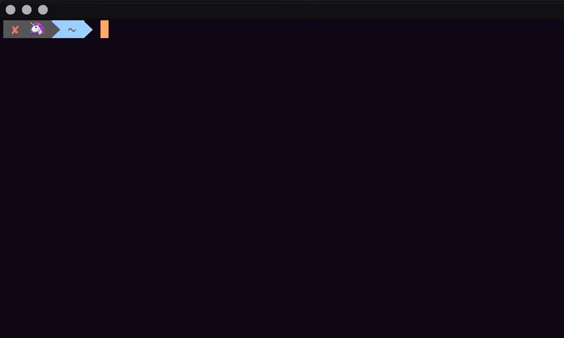

# Lighthouse CI

> A useful wrapper around Google Lighthouse CLI

[](https://github.com/xojs/xo)



## Install

```
$ npm install -g lighthouse-ci
```

## Usage


## Created by

- [andreasonny83](https://about.me/andreasonny83)

## License

MIT