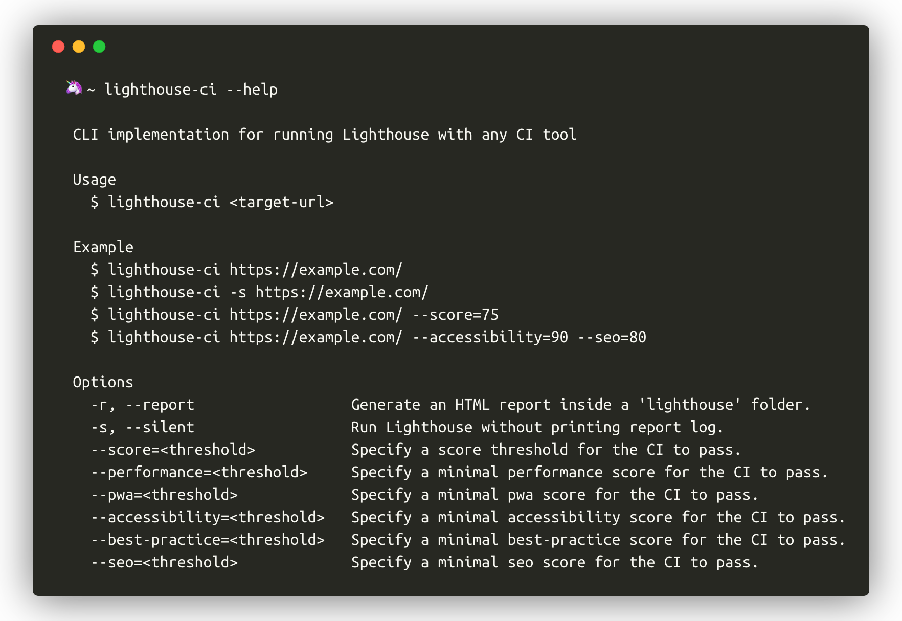

# Lighthouse CI

> A useful wrapper around Google Lighthouse CLI



## Install

```
$ npm install -g lighthouse-ci
```

## Usage

```
$ lighthouse-ci --help

  Usage
    $ lighthouse-ci <target-url>

  Example
    $ lighthouse-ci https://example.com/

    ┌────────────────┬────────┐
    │    (index)     │ Values │
    ├────────────────┼────────┤
    │  performance   │   1    │
    │      pwa       │  0.45  │
    │ accessibility  │  0.88  │
    │ best-practices │  0.94  │
    │      seo       │  0.89  │
    └────────────────┴────────┘
```

## Created by

- [andreasonny83](https://about.me/andreasonny83)

## License

MIT